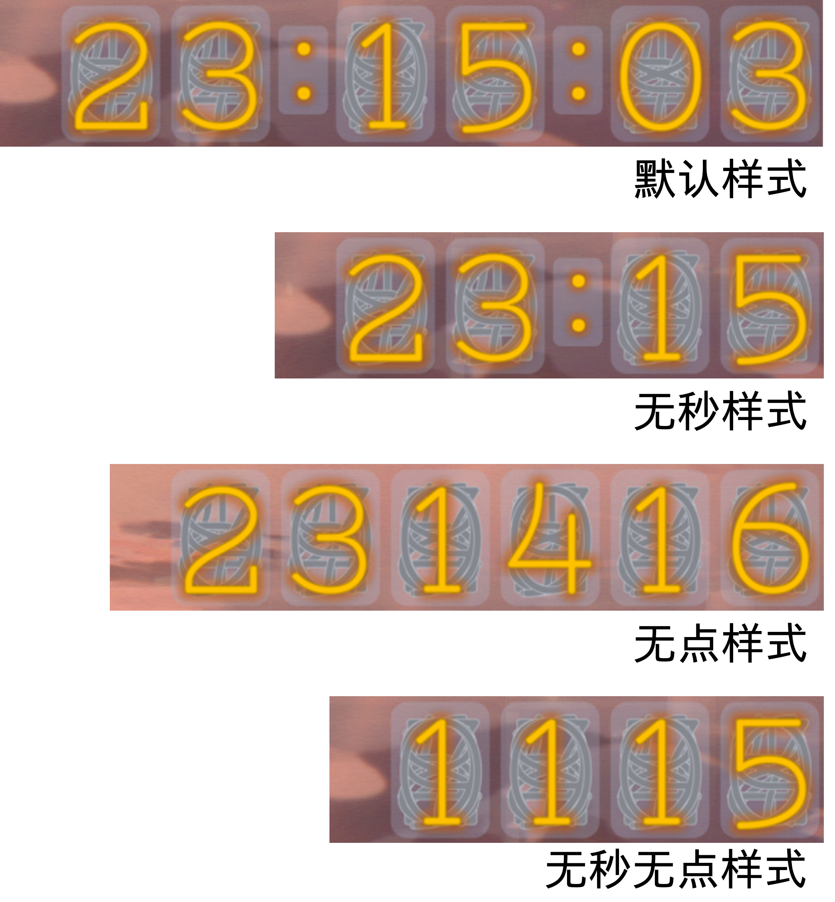
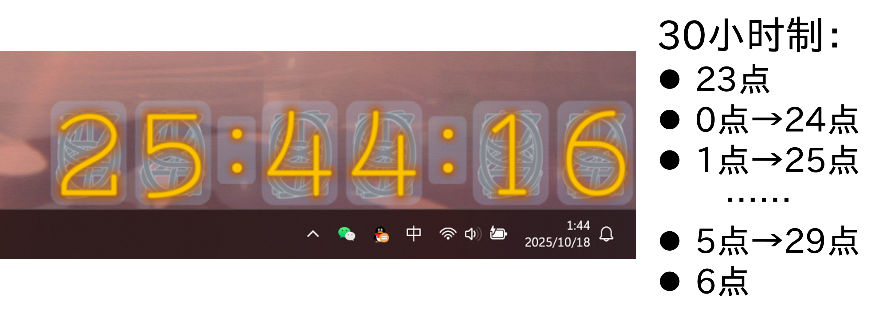

# NixieTubeClock-Fshr 辉光管时钟(Rainmeter插件)

## 插件简介

本插件为[Rainmeter](https://www.rainmeter.net/)皮肤包，是模拟辉光管造型的桌面时钟。

有多种样式可供选择： 

也能实现[30小时制](https://www.qiuwenbaike.cn/wiki/三十小时制)显示：

---

## 显示配置

|        配置文件         |                           显示效果                           |
| :---------------------: | :----------------------------------------------------------: |
|     **NTC-12H.ini**     |                    **12小时制，HH:MM:SS**                    |
|    NTC-12H-noSec.ini    |                   12小时制(无秒式)，HH:MM                    |
|    NTC-12H-noDot.ini    |                   12小时制(无点式)，HHMMSS                   |
| NTC-12H-noSec-noDot.ini |                  12小时制(无秒无点式)，HHMM                  |
|     **NTC-24H.ini**     |                    **24小时制，HH:MM:SS**                    |
|    NTC-24H-noSec.ini    |                   24小时制(无秒式)，HH:MM                    |
|    NTC-24H-noDot.ini    |                   24小时制(无点式)，HHMMSS                   |
| NTC-24H-noSec-noDot.ini |                  24小时制(无秒无点式)，HHMM                  |
|     **NTC-30H.ini**     | **[30小时制](https://www.qiuwenbaike.cn/wiki/三十小时制)，HH:MM:SS** |
|    NTC-30H-noSec.ini    |                   30小时制(无秒式)，HH:MM                    |
|    NTC-30H-noDot.ini    |                   30小时制(无点式)，HHMMSS                   |
| NTC-30H-noSec-noDot.ini |                  30小时制(无秒无点式)，HHMM                  |

---

## 安装说明

0. 前往[Rainmeter官网](https://www.rainmeter.net/)安装软件本体。
1. 在[Releases](https://github.com/Fisher4124/NixieTubeClock-Fshr-Rainmeter/releases)页面下载`NixieTubeClock-Fshr.rmskin`（或[百度网盘](https://pan.baidu.com/s/1rnCdKQUy_qIQnrmf1Sn18w)）。
2. 启动Rainmeter后，双击rmskin文件安装。
3. 状态栏系统托盘 → 找到Rainmeter图标，单击右键 → 进入【管理】界面调试。 

---

## 鸣谢及著作权声明

本插件的部分源代码来自Mistic的[NixieClock](https://forum.rainmeter.net/viewtopic.php?t=36775)，均基于[MIT License](https://opensource.org/license/MIT)协议发布。

所使用的字体[Nixie One](https://www.dafont.com/nixie-one.font)遵循[SIL Open Font License](https://opensource.org/license/ofl-1-1)协议。

此外，30小时制的代码受到[Sam Toki](https://github.com/SamToki/)的[文章](https://zhuanlan.zhihu.com/p/319783535)启发。